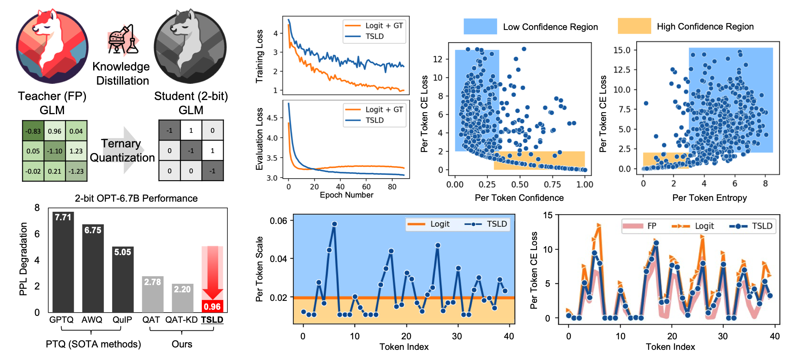

# Token-Scaled Logit Distillation for Ternary Weight Generative Language Models
[](https://openreview.net/forum?id=FUnEkOkodU)
[](https://arxiv.org/abs/2308.06744)
[](https://neurips.cc/virtual/2023/poster/72260)

This repository contains the implementation for the paper [Token-Scaled Logit Distillation for Ternary Weight Generative Language Models](https://arxiv.org/abs/2308.06744) 🤗

**TL;DR**: Investigate the unexplored challenges of Ternary QAT on GLMs and propose an innovative KD method to overcome them


*GLM images are from https://github.com/Beomi/KoAlpaca*

## Features

- Fully compatible with the HuggingFace Transformers package.
- Implements QAT with Knowledge Distillation(KD), including various KD options (Logit, L2L, TSLD).

## Install
Intall via pip:
```
pip install -r requirements.txt
```
Alternatively, use a Docker container:
```
docker pull minsoo2333/llm-ft-ms:latest
```

## QAT Settings

### Quantization Arg Options (args.py)
- Loss options for QAT-KD.
   - `gt`: grount-truth(GT) loss only
   - `logit`: logit distillation only
   - `l2l`: layer-to-layer distillation (logit + attention outputs + layer outputs)
   - `logit_gt`: logit distillation + gt loss
   - `tsld`: token-scaled logit distillation
- TSLD
   - `kd_tsld_temp`: temperature value for softmax function with token-scaling in TSLD. (default: 10)
- Quantization
   - `learned_scale`: option for 2-bit quantizer - true: Pact+(QuantGPT), false: TWN - default
   - `per_tensor`: option for quantization granurality - true: per-tensor, false: per-channel
- Training Settings
   - `save_model_weight`: whether save QAT model (`save_model_qweight`: whether save quantized weight or FP weight to quantize)

     
(Note: For L2L distillation, modifications are needed for the model to return attention score instead of attention weights in the Transformers repository.)

### Notes
- To more accurately reproduce the QAT-KD results from the paper, it is recommended to disable the bfloat16 (Accelerator) training option in the Huggingface Trainer API. This can be achieved by omitting the `--bf16` and `--torch_dtype` in the scripts.
   - The comparison results of BF16 and FP32 training are as follows.
   - Experiments were conducted on an A100-40GB GPU using Transforms version 4.35.2.
   
     | OPT-1.3B PPL(↓) | BF16 QAT-KD | FP32 QAT-KD |
     |-----------------|-------------|-------------|
     | FP16            | 12.34       | 12.34       |
     | W2A16 Logit     | 15.09       | 13.58       |
     | W2A16 Logit + GT| 15.02       | 14.20       |
     | W2A16 TSLD      | **14.81**   | **13.24**   |

- Update planned for the QAT script related to CSQA fine-tuning. (TODO)

### Hyper-Parameter

- For QAT of various Generative Language Models (GLMs), we use the following learning rate and epoch numbers.
- QAT Batch size: 4

| GLMs       | GPT | GPT | GPT | GPT | OPT | OPT | OPT | OPT | GPT-Neo | LLaMA |
|---------------------|----------|----------|----------|----------|----------|----------|----------|----------|--------------|----------|
| Size       | 0.1B | 0.3B | 0.6B | 1.5B | 0.1B | 1.3B | 2.7B | 6.7B | 1.3B | 7B |
| LR (FP)  | 1e-4     | 1e-4     | 1e-4     | 1e-4     | 1e-4     | 1e-4     | 5e-5     | 5e-5     | 1e-4         | 5e-5     |
| Epoch (FP)          | 3        | 3        | 3        | 3        | 3        | 3        | 3        | 3        | 3            | 1        |
| LR (QAT) | 1e-4     | 1e-4     | 1e-4     | 1e-4     | 1e-4     | 1e-4     | 5e-5     | 5e-5     | 1e-4         | 7e-5     |
| Epoch (QAT)         | 90       | 60       | 30       | 30       | 90       | 30       | 30       | 10       | 30           | 5        |

- For the softmax function in the TSLD implementation, we use a temperature value of 10.

## Reference

If you find TSLD useful or relevant to your research, please kindly consider citing our paper :)
```
@inproceedings{
kim2023tokenscaled,
title={Token-Scaled Logit Distillation for Ternary Weight Generative Language Models},
author={Minsoo Kim and Sihwa Lee and Janghwan Lee and Sukjin Hong and Du-Seong Chang and Wonyong Sung and Jungwook Choi},
booktitle={Thirty-seventh Conference on Neural Information Processing Systems},
year={2023},
url={https://openreview.net/forum?id=FUnEkOkodU}
}
```

For further question, contact me anytime (minsoo2333@hanyang.ac.kr) or kindly leave questions in issues tab.
